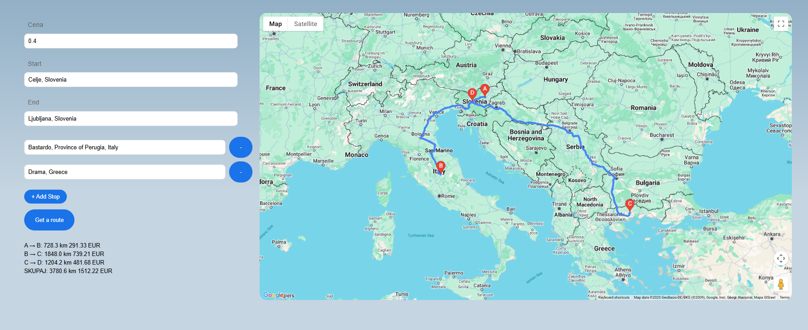

**Route Per Parcel** is a WebApp made with Google Routes API that lets you select a route like in Google Map and Waypoints along the way. You enter a price and it automatically calculates the price of a leg of the route and the whole route.

<p align="center">
  
</p>


### Installation (locally)

1. **Clone the repository**:
```bash
git clone https://github.com/JernejRozman/Routes-per-partes
```
2. **Installation of Node.js**
```bash
https://nodejs.org/en
```   
3. **Initialization of node.js:**
```bash
npm init
```
4. **Acquisition of an API key and put it into fucntion/server.js in public/index.html:**
```bash
https://cloud.google.com/docs/authentication/api-keys
```
5. **Running the server locally**
```bash
node function/server.js
```

